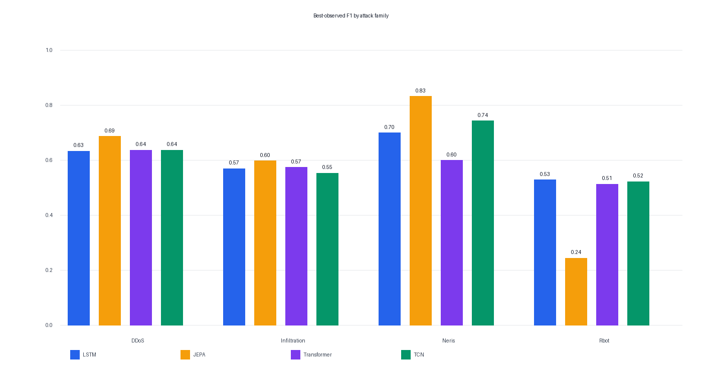
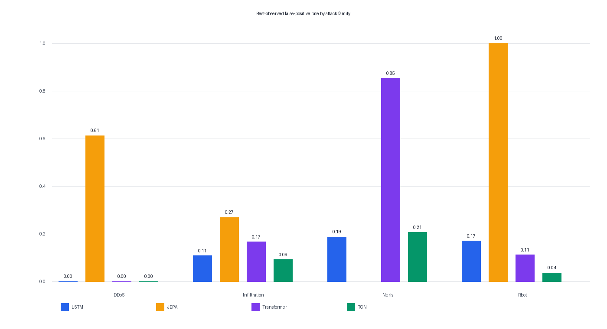
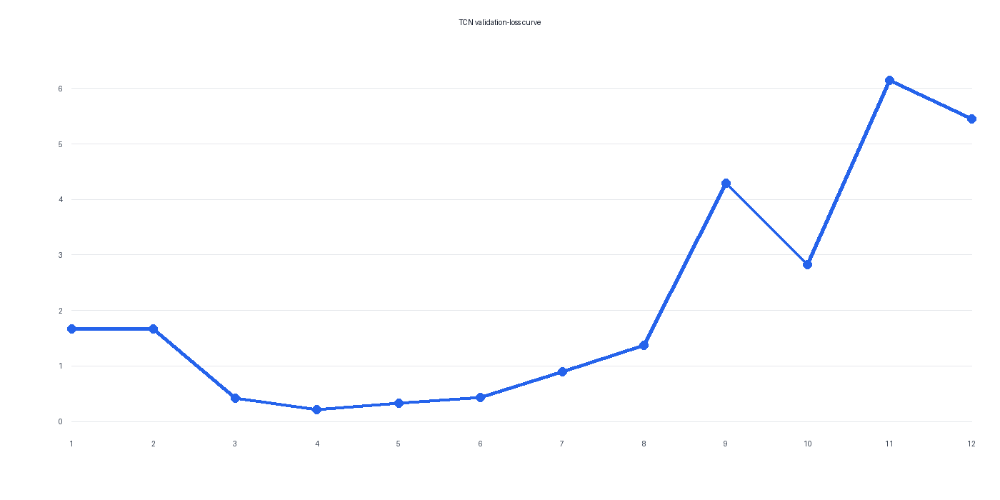

# Cybersecurity World Model

Research-grade PyTorch implementation of a probabilistic network world model for
future-state forecasting, attack-stage progression, and early cyber-risk warning.

The implementation follows `cybersecurity_world_model_dataset_KT_v2.md`.

## Quick start

```bash
cp .env.example .env
./scripts/download_datasets.sh --starter
./training.sh
```

`training.sh` creates `.venv`, installs locked dependencies, chooses CUDA, Apple
Metal (MPS), or CPU automatically, validates the configuration and data, and
starts training.

For a no-download smoke test:

```bash
./training.sh --config configs/experiment/smoke.yaml
```

See `docs/DEVELOPMENT.md` for data layout and extension points.

Use `notebooks/dataset_eda.ipynb` for memory-bounded dataset and trajectory
analysis. `docs/CODEBASE.md` explains module ownership and extension.

## What the system does

Cybersecurity World Model converts flow-level network telemetry into fixed 10-second
trajectory windows. The probabilistic world model consumes six windows of history and
forecasts the next seven, estimating future state, malicious risk, compromise risk, and
MITRE-aligned attack stage. Availability masks prevent missing telemetry from becoming
evidence.

The prepared corpus contains eleven CIC-IDS2018 and CTU-13 trajectories across seven
attack families. The reproducible explicit split uses seven trajectories for training
and four complete trajectories for validation (DDoS, infiltration, Neris, and Rbot).
Risk labels use a 1% malicious-flow-fraction threshold; stage labels use modal
aggregation with 0.8 coverage. The deployed model is the epoch-16 probabilistic LSTM.
Latent JEPA, Temporal Transformer, and causal Temporal CNN variants were evaluated on
the identical split but were not adopted because they failed the all-family
no-regression guard. See [`docs/MODEL_RESULTS.md`](docs/MODEL_RESULTS.md) for the full
comparison, curves, threshold sweeps, and dataset limitations.

The stage taxonomy includes four categories with no defensible flow-level training
evidence in this corpus: `RECONNAISSANCE`, `LATERAL_MOVEMENT`,
`COMMAND_AND_CONTROL`, and `EXFILTRATION`. These are documented scope boundaries.

### Results at a glance

The report figures are reproducible with `python scripts/generate_result_figures.py`:







## Run the demonstration app

The app is fully offline and uses the trained epoch-16 probabilistic LSTM, its
saved normalizer, the prepared demonstration trajectories, and the current
logistic-regression benchmark artifact.

1. Install the locked project environment:

   ```bash
   uv sync --extra pcap --extra dev
   ```

2. Confirm the required artifacts exist:

   ```bash
   test -f checkpoints/world_model_full_combined_lstm/best.pt
   test -f checkpoints/world_model_full_combined_lstm/normalizer.npz
   test -f runs/world_model_full_combined_lstm/benchmark.json
   ```

3. Launch the primary Flask interface from the repository root:

   ```bash
   python flask_app.py
   ```

   Open `http://127.0.0.1:5000`. The earlier Streamlit interface remains
   available as a fallback with `streamlit run app.py`.

Use either bundled CIC-IDS2018 sample for an immediate end-to-end walkthrough,
or upload a PCAP/PCAPNG or supported flow CSV. PCAP support requires the `pcap`
extra shown above. The application makes no external API calls and enables no
application telemetry; Streamlit's optional usage statistics can also be
disabled globally with `STREAMLIT_BROWSER_GATHER_USAGE_STATS=false`.
