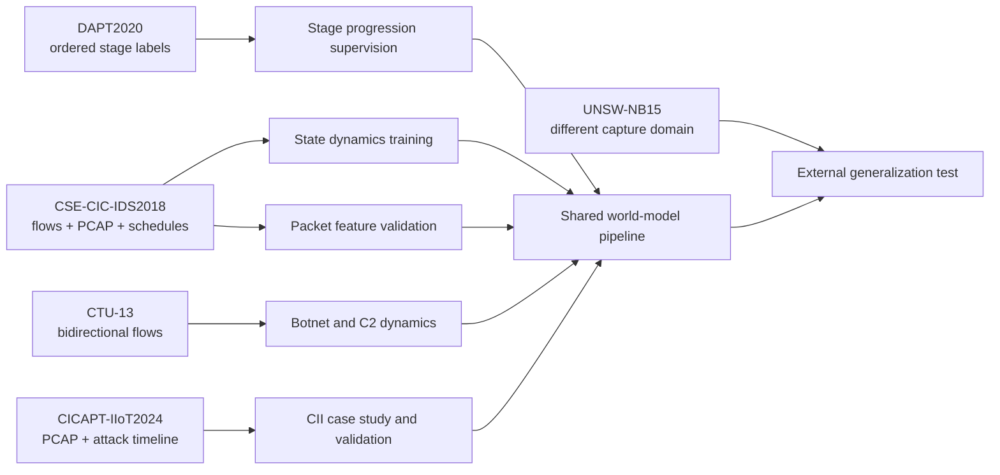
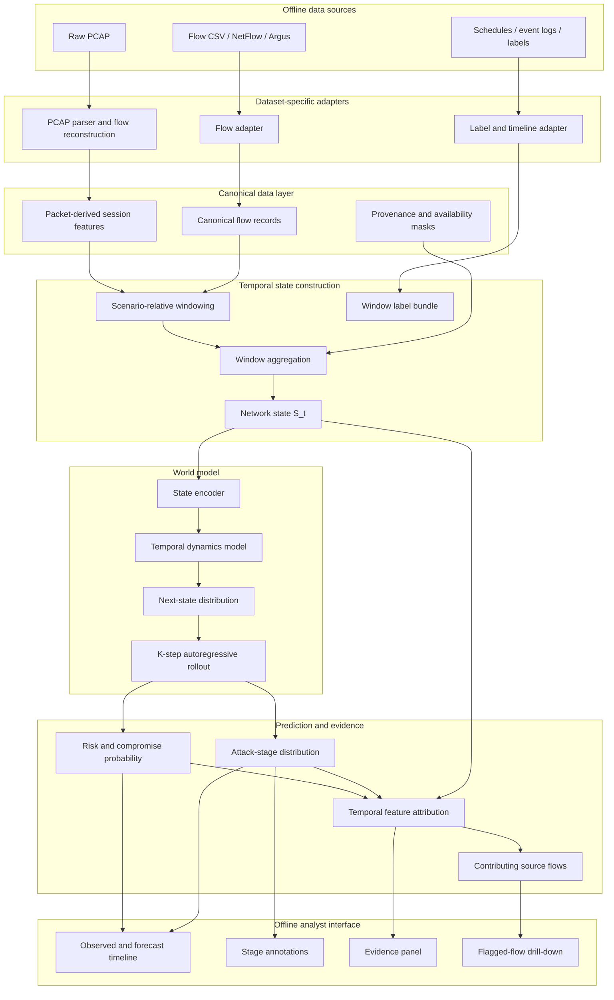
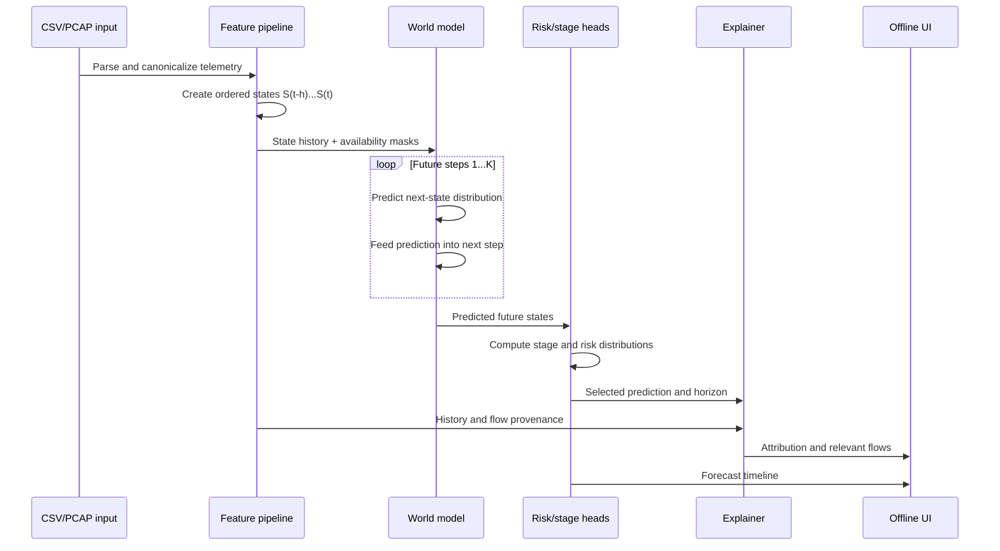
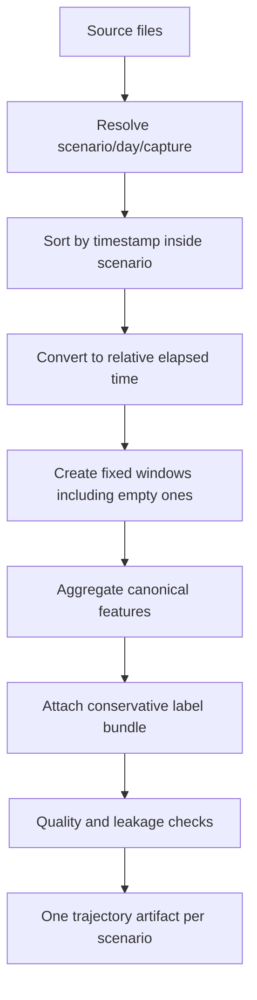

# Cybersecurity World Model — Development Knowledge Transfer

**Status:** Development source of truth  
**Version:** 3.0  
**Last updated:** 2026-09-15  
**Scope:** Offline prototype for predictive cyber defence using flow and packet telemetry

---

## 1. Purpose

This document defines the research decisions, dataset roles, labels, feature contracts, model behavior, evaluation protocol, and implementation boundaries for the **Cybersecurity World Model / Predictive Cyber Defence** prototype.

The objective is:

> Given a history of observed network states, learn how the network evolves, roll the learned dynamics forward, and estimate future malicious activity, compromise risk, and attack-stage progression with interpretable evidence.

This is not a conventional intrusion classifier.

```text
Conventional IDS:
current traffic -> benign or malicious

Required system:
traffic history -> network states -> learned dynamics -> future-state rollout
                -> future risk + attack stages + explanations
```

### 1.1 Non-negotiable behavior

The prototype must:

1. Ingest compatible CSV/NetFlow data and raw PCAP data.
2. Use both flow-level and packet-level evidence.
3. Construct ordered, independent scenario trajectories.
4. Learn a probability distribution for the next network state, conditioned on recent history.
5. Recursively roll predictions forward for `K` future windows.
6. Produce a risk timeline and stage distribution for each future window.
7. Map stages only where source evidence justifies the mapping.
8. Explain which observed features and time windows drove a prediction.
9. Run fully offline without cloud inference APIs.
10. Include reproducible configuration, checkpoints, evaluation, and an analyst-facing demo.

### 1.2 Permitted claim

The defensible MVP claim is:

> The system forecasts future malicious network behaviour and, for stage-labelled scenarios, predicts progression toward later attack stages.

Do **not** claim that every dataset contains a complete kill chain. Broad IDS datasets support malicious-behaviour forecasting. Only explicitly stage-labelled campaigns support direct stage-progression evaluation.

---

## 2. Dataset Research Decisions

### 2.1 Portfolio

Use five datasets with deliberately different roles rather than treating them as interchangeable.

| Dataset | Required role | Stage supervision | Packet suitability | MVP use |
|---|---|---:|---:|---|
| **DAPT2020** | Primary APT stage progression | Strong: four ordered phases | Public release must be audited; do not assume raw PCAP | Train/validate progression from flows |
| **CSE-CIC-IDS2018** | Primary volume, flow/packet dynamics, infiltration case study | Partial; scheduled scenarios | Strong: PCAP and event logs available | Main dynamics and packet feature development |
| **CTU-13** | Sustained botnet/C2 behaviour | Narrow: botnet and C&C | Limited: original complete mixed PCAP unavailable | Auxiliary flow-level C2 training |
| **CICAPT-IIoT2024** | Stage-aware IIoT/CII case study | Strong MITRE metadata | Strong: merged PCAP and packet CSV | Fine-tune, validate, demonstrate CII relevance |
| **UNSW-NB15** | External domain-shift evaluation | Weak for ordered progression | Strong but large: about 100 GB PCAP | External generalization test |

### 2.2 Why each dataset has this role

#### DAPT2020

DAPT2020 was constructed around a five-day APT experiment with one benign day and four phases:

1. Reconnaissance
2. Foothold establishment
3. Lateral movement
4. Data exfiltration

Its flow records include `Activity` and `Stage`, making it the best fit in this portfolio for supervised stage progression.

Source: [DAPT2020 original paper](https://sailik1991.github.io/files/DAPT_at_MLHat2020.pdf)

**Constraint:** audit the downloadable artifacts first. If raw PCAP is not available, use DAPT2020 only in the flow/stage branch.

#### CSE-CIC-IDS2018

CSE-CIC-IDS2018 provides daily PCAPs, machine logs, attack schedules, and more than 80 CICFlowMeter features. Its infiltration scenario includes malicious delivery/exploitation, backdoor behavior, and internal scanning. It is useful for a focused progression case study, although most other classes are isolated attack types rather than stages of one campaign.

Source: [CSE-CIC-IDS2018 official page](https://www.unb.ca/cic/datasets/ids-2018.html)

#### CTU-13

CTU-13 contains 13 manually analysed botnet captures with labelled bidirectional NetFlows. It is valuable for long-running botnet and C&C dynamics.

The original public release contains complete mixed traffic in bidirectional NetFlow, but its PCAP contains botnet traffic only; the complete mixed PCAP is unavailable for privacy reasons. Therefore CTU-13 is a flow-level auxiliary source, not the primary packet branch.

Source: [CTU-13 official page](https://www.stratosphereips.org/datasets-ctu13)

#### CICAPT-IIoT2024

CICAPT-IIoT2024 provides an APT29-inspired IIoT campaign, attack timestamps/categories, provenance logs, and PCAP. It directly supports the Critical Information Infrastructure story.

It is extremely imbalanced. The paper reports millions of benign packets but only about one thousand attack-labelled network packets. It should not be the only source used to train a deep model.

Sources: [official page](https://www.unb.ca/cic/datasets/iiot-dataset-2024.html), [dataset paper](https://www.cs.unb.ca/~sray/papers/CICAPT_IIoT_paper_Mobiquitous24_author_copy.pdf)

#### UNSW-NB15

UNSW-NB15 provides PCAP, Argus/Bro files, CSVs, a ground-truth table, and an event list across nine attack categories. It is a broad intrusion dataset rather than a clean ordered APT campaign.

Use it to test whether the representation and risk model generalize to a different environment. Do not report progression accuracy on labels manufactured from its categories.

Source: [UNSW-NB15 official page](https://research.unsw.edu.au/projects/unsw-nb15-dataset)

### 2.3 Dataset role diagram



---

## 3. System Architecture

### 3.1 End-to-end architecture



### 3.2 Runtime flow



### 3.3 Layer responsibilities

| Layer | Unit | Purpose |
|---|---|---|
| Raw telemetry | packet or source flow | Preserve original evidence |
| Canonical flow | bidirectional session/flow | Common semantics across sources |
| Network state | time window | Describe the network during an interval |
| Dynamics target | next state | Teach network evolution |
| Label bundle | window/scenario | Teach risk/stage where supported |
| Explanation | prediction + horizon | Connect forecast to observed evidence |

---

## 4. Canonical Data Contracts

### 4.1 Rules

1. Never join real-world clocks from unrelated datasets.
2. Never connect the final state of one scenario to another scenario.
3. Never invent an unavailable measurement.
4. Store a Boolean availability mask beside nullable model features.
5. Store source dataset, scenario, file, and record provenance.
6. Convert units explicitly and test them.
7. Fit learned preprocessing on training data only.
8. Preserve raw IPs for investigation but do not feed them to the model by default.

### 4.2 Canonical flow record

```yaml
identity:
  dataset_id: string
  scenario_id: string
  source_file: string
  source_record_id: string
  timestamp_start_us: int64
  timestamp_end_us: int64
  src_ip: string
  dst_ip: string
  src_port: int|null
  dst_port: int|null
  protocol: int|string

flow:
  duration_us: float
  fwd_packets: float
  bwd_packets: float
  fwd_bytes: float
  bwd_bytes: float
  flow_iat_mean_us: float|null
  flow_iat_std_us: float|null
  fwd_iat_mean_us: float|null
  bwd_iat_mean_us: float|null
  syn_count: float|null
  ack_count: float|null
  fin_count: float|null
  rst_count: float|null
  psh_count: float|null
  urg_count: float|null

packet_derived:
  ttl_fwd_mean: float|null
  ttl_bwd_mean: float|null
  ttl_variance: float|null
  tcp_window_fwd_mean: float|null
  tcp_window_bwd_mean: float|null
  ip_fragment_count: float|null
  retransmission_count: float|null
  payload_size_mean: float|null
  payload_size_std: float|null
  payload_size_min: float|null
  payload_size_max: float|null

labels:
  source_label: string|null
  source_stage: string|null
  label_confidence: float
```

All nullable numerical model fields require corresponding entries in `feature_available`.

### 4.3 PCAP flow reconstruction

Default session key:

```text
(protocol, endpoint_A, port_A, endpoint_B, port_B)
```

Canonicalize endpoint ordering while preserving initiator/responder direction. Default configurable timeouts:

- TCP inactive timeout: 120 seconds
- UDP inactive timeout: 60 seconds
- active flow timeout: 300 seconds
- TCP termination: close after FIN/RST with a short grace period

#### Required packet feature definitions

- `ttl_fwd_mean`, `ttl_bwd_mean`: arithmetic mean by direction.
- `ttl_variance`: population variance across IP TTL values in the session.
- `ip_fragment_count`: packets with non-zero fragment offset or more-fragments flag.
- `tcp_window_*_mean`: mean advertised TCP receive window by direction.
- `payload_size_*`: transport payload statistics, excluding link/IP/transport headers.
- `retransmission_count`: repeated TCP sequence ranges in the same direction, excluding pure ACKs. Document overlap handling.
- TCP flag counts: packet counts containing each flag; one packet may increment multiple flags.

Store extractor version and parameters in every dataset manifest.

### 4.4 Temporal windowing

Initial experiment grid:

```yaml
window_seconds: [5, 10, 30]
stride_seconds: equal_to_window
history_windows: [6, 12]
forecast_windows: [1, 3, 6]
```

First baseline:

```yaml
window_seconds: 10
stride_seconds: 10
history_windows: 6
forecast_windows: 6
```

This provides one minute of observed history and one minute of forecast horizon.

Convert each scenario to elapsed time starting at zero. Retain empty windows with zero traffic counts and valid availability metadata; otherwise timing information is lost.

### 4.5 Network state `S_t`

#### Volume and population

- total flows and TCP/UDP/other counts
- forward/backward/total packets and bytes
- packet and byte rates
- unique and new source/destination IP counts
- unique source/destination port counts

#### Distribution and timing

- mean/std/max flow duration
- packet-size mean/std/min/max
- flow-IAT mean/std/max
- active/idle statistics where supported
- inbound/outbound byte and packet ratios

#### TCP and packet behaviour

- SYN, ACK, FIN, RST, PSH, and URG rates
- incomplete TCP-handshake ratio
- mean TCP window by direction
- retransmission, fragment, and payload statistics
- mean TTL and TTL variance

#### Scan behaviour

Compute per source within a window, then aggregate:

- destination-port fan-out
- destination-host fan-out
- sequential-port ratio: fraction of consecutive unique ports with absolute difference `1`
- randomized-port score: normalized entropy of destination-port buckets
- failed-connection ratio
- low-and-slow scan persistence across history windows

#### Missingness

For every feature `x_i`, provide both `value_i` and `available_i`. Never replace unavailable values with zero without the mask.

### 4.6 Normalization

- Apply `log1p` to configured heavy-tailed non-negative counts/rates.
- Use robust or standard scaling fitted on training scenarios only.
- Learn clipping thresholds from training data and record clip rates.
- Freeze transformations before validation and external testing.
- Do not input `dataset_id` to the MVP model; retain it for evaluation slices.

---

## 5. Label Design

### 5.1 Two layers

Store:

1. **Source truth:** original label, activity, timestamps, and supplied tactic/technique.
2. **Operational label:** a conservative common vocabulary used by the model.

### 5.2 Operational vocabulary

| ID | Label | Meaning |
|---:|---|---|
| 0 | `NORMAL` | Reliably labelled normal traffic |
| 1 | `RECONNAISSANCE` | Pre-compromise probing/scanning with evidence |
| 2 | `INITIAL_ACCESS` | Foothold or successful initial compromise |
| 3 | `LATERAL_MOVEMENT` | Movement to another internal host/account |
| 4 | `COMMAND_AND_CONTROL` | Confirmed control-channel communication |
| 5 | `EXFILTRATION` | Confirmed attacker-associated outbound data transfer |
| 6 | `IMPACT` | Availability/integrity impact such as DoS or destruction |
| 7 | `OTHER_MALICIOUS` | Malicious evidence without a justified target stage |
| 8 | `UNKNOWN` | Insufficient, background, conflicting, or unmappable evidence |

Also retain:

```yaml
mitre_tactic: string|null
mitre_technique_id: string|null
mapping_confidence: float
mapping_evidence: string
```

These labels are not universally linear. `IMPACT` may occur without earlier stages. Ordered-progression metrics are restricted to scenarios with documented campaign order.

### 5.3 Dataset mapping policy

#### DAPT2020

| Source stage | Operational label | Reason |
|---|---|---|
| Benign | `NORMAL` | Direct |
| Reconnaissance | `RECONNAISSANCE` | Direct |
| Foothold Establishment | `INITIAL_ACCESS` | Direct campaign phase |
| Lateral Movement | `LATERAL_MOVEMENT` | Direct campaign phase |
| Data Exfiltration | `EXFILTRATION` | Direct campaign phase |

DAPT2020 is eligible for full ordered-progression supervision.

#### CSE-CIC-IDS2018

| Source label/evidence | Operational label | Rule |
|---|---|---|
| BENIGN | `NORMAL` | Direct |
| DoS / DDoS | `IMPACT` | Availability impact |
| PortScan or scheduled internal scan | `RECONNAISSANCE` | Require schedule/host evidence |
| Infiltration label alone | `OTHER_MALICIOUS` | Does not identify the internal stage |
| Confirmed exploit/backdoor event | `INITIAL_ACCESS` | Only from schedule/log evidence |
| Confirmed Ares control channel | `COMMAND_AND_CONTROL` | Only when the channel is identified |
| Brute Force | `OTHER_MALICIOUS` | Attempts do not prove access |
| Web Attack | `OTHER_MALICIOUS` | Promote only with success evidence |
| Heartbleed | `OTHER_MALICIOUS` | Do not claim exfiltration without evidence |
| Generic Botnet | `OTHER_MALICIOUS` | Do not equate all botnet traffic with C2 |

Only infiltration segments backed by schedule/log evidence are eligible for ordered-stage evaluation.

#### CTU-13

| Source evidence | Operational label | Rule |
|---|---|---|
| Normal | `NORMAL` | Direct |
| Background | `UNKNOWN` | Not reliable benign truth; exclude from supervised stage loss |
| C&C channel | `COMMAND_AND_CONTROL` | Direct manual label |
| Botnet without C&C evidence | `OTHER_MALICIOUS` | Malware traffic is broader than C2 |

CTU-13 supports C2 forecasting, not a full kill chain.

#### CICAPT-IIoT2024

| Source tactic | Operational label |
|---|---|
| Lateral Movement | `LATERAL_MOVEMENT` |
| Command and Control | `COMMAND_AND_CONTROL` |
| Exfiltration | `EXFILTRATION` |
| Impact/Data Destruction | `IMPACT` |
| Credential Access, Persistence, Defence Evasion, Collection | `OTHER_MALICIOUS` |
| Discovery | `RECONNAISSANCE` only when documented as pre-compromise; otherwise `OTHER_MALICIOUS` |

Always preserve the supplied MITRE tactic/technique when the operational label is broader.

#### UNSW-NB15

| Source category | Operational label |
|---|---|
| Normal | `NORMAL` |
| Reconnaissance | `RECONNAISSANCE` |
| DoS | `IMPACT` |
| Fuzzers, Analysis, Backdoors, Exploits, Generic, Shellcode, Worms | `OTHER_MALICIOUS` |

Use UNSW mainly for binary future-risk and next-state generalization. Do not infer ordered stages from category names.

### 5.4 Window label bundle

```yaml
is_malicious: 0|1|null
stage_primary: one operational label
stage_presence: multi_hot[9]
malicious_flow_fraction: float|null
label_coverage_fraction: float
mapping_confidence: float
ordered_progression_eligible: bool
source_labels_present: list[string]
```

Rules:

1. Use `NORMAL` only when all covered labelled traffic is reliably normal.
2. Use `UNKNOWN` when reliable coverage is absent or conflicting.
3. `stage_presence` records every supported stage; do not erase rare attacks through majority voting.
4. For stage-aware scenarios, `stage_primary` is the documented campaign stage.
5. For non-stage datasets, select the supported malicious label with greatest labelled-flow share; ties use latest event time. It is not eligible for ordered progression.
6. Windows below the label-coverage threshold are excluded from supervised label losses but may train dynamics.

Default label-coverage threshold: `0.80`.

### 5.5 Prediction targets

Expose three outputs instead of one ambiguous infiltration score.

#### Future malicious-activity risk

```text
P(any reliably malicious state occurs within the next K windows)
```

#### Future compromise risk

Positive stages:

```text
INITIAL_ACCESS
LATERAL_MOVEMENT
COMMAND_AND_CONTROL
EXFILTRATION
```

Definition:

```text
P(any positive compromise stage occurs within the next K windows)
```

DoS/Impact is malicious but is not automatically called infiltration.

#### Per-horizon stage distribution

For every `j = 1..K`:

```text
P(A_(t+j) = stage | observed history)
```

On eligible campaigns also report:

```text
P(a documented later campaign stage occurs within K windows)
```

---

## 6. Trajectory Construction

### 6.1 Flow



Never construct transitions between unrelated scenarios, datasets, or split partitions.

### 6.2 Sequence examples

```text
S0,S1 -> S2
S1,S2 -> S3
S2,S3 -> S4
```

Six-step rollout:

```text
observed S(t-5)...S(t)
  -> distribution for S(t+1)
  -> predicted/sample S-hat(t+1)
  -> ...
  -> S-hat(t+6)
```

### 6.3 Leakage controls

- Split by complete scenario/capture/day, never adjacent random windows.
- Keep overlapping windows from one time region in one split.
- Fit all learned preprocessing on training only.
- Detect duplicate flows/files across mirrors.
- Remove attack names, label strings, label-bearing filenames, and fixed attacker/victim identities from inputs.
- Run identity-only and time-of-day leakage probes.

---

## 7. Model Specification

### 7.1 MVP

```text
[state values, availability masks]
  -> state projection
  -> 2-layer LSTM
  -> latent state z_t
  -> probabilistic next-state head
  -> predicted mean and uncertainty for S_(t+1)
  -> recursive K-step rollout
  -> attack-stage head
  -> malicious-risk and compromise-risk heads
```

Maintain two controlled architectures:

1. `probabilistic_lstm`: the mandatory LSTM baseline with a probabilistic next-state head.
2. `latent_jepa`: the research model. It predicts future state embeddings from the observed context, applies VICReg anti-collapse regularization, and decodes the embeddings into explicit probabilistic future network states.

The JEPA branch is hybrid by design: latent prediction supplies semantic dynamics, while state decoding preserves the requirement to forecast observable network states. Do not replace the direct baseline without a same-split ablation.

SIGReg/LeJEPA is a later controlled ablation, not the initial default. It is newer and must demonstrate an advantage over VICReg on this telemetry domain before adoption. Add it behind configuration with objective-level tests if evaluated. A Transformer remains a later architecture experiment.

### 7.2 Probabilistic behavior

The model must not output only a point vector and call it `P(S_(t+1)|history)`.

Minimum implementation:

- predict mean and log-variance for normalized continuous state features;
- use an appropriate count head where practical;
- optimize negative log-likelihood plus auxiliary label losses;
- expose uncertainty bands in the UI.

Later alternatives: mixture-density heads, quantiles, deep ensembles, or stochastic latent dynamics.

### 7.3 Loss

```text
L = lambda_state * L_next_state
  + lambda_stage * L_stage
  + lambda_malicious * L_malicious_risk
  + lambda_compromise * L_compromise_risk
```

- Apply state loss wherever valid next states exist.
- Apply label losses only above coverage/confidence thresholds.
- Apply ordered-progression loss only to eligible campaigns.
- Use class weighting or focal loss; do not blindly oversample sequential windows.
- Begin with teacher forcing, then use scheduled sampling or multi-step loss to reduce rollout drift.

### 7.4 Multi-dataset training

- Sample complete sequences, never isolated shuffled states.
- Balance batches by dataset/scenario without changing sequence order.
- Track metrics by dataset and stage.
- Use availability masks but not dataset identity as an MVP input.
- Add domain adaptation only after establishing the shared-model baseline.

### 7.5 Baselines

Required:

1. Logistic Regression on the same flattened state history for future risk.
2. Persistence state baseline: `S-hat(t+1) = S(t)`.
3. Stage-frequency/Markov baseline on eligible trajectories.
4. LSTM sequence classifier without state rollout.

The fourth baseline tests whether explicit future-state prediction adds value beyond temporal classification.

---

## 8. Explainability

### 8.1 Output contract

```yaml
prediction:
  horizon: t+3
  malicious_risk: 0.81
  compromise_risk: 0.62
  predicted_stage: INITIAL_ACCESS
  uncertainty: [0.49, 0.73]

evidence:
  top_features:
    - destination_port_fanout
    - syn_rate
    - iat_variance
  top_observed_windows: [t-1, t]
  contributing_source_flows:
    - source_record_id: ...
```

### 8.2 Policy

- Attention weights are diagnostics, not sufficient explanations by themselves.
- Use SHAP for compatible baselines and integrated gradients/temporal occlusion for the sequence model.
- Attribute a specific output at a specific horizon to observed inputs.
- Validate explanations with feature/time-window ablation.
- Preserve links from aggregate features to contributing source flows.

---

## 9. Evaluation

### 9.1 Split plan

Exact identifiers are selected after the feasibility audit.

```text
Training:
  DAPT2020 selected campaigns/days
  CSE-CIC-IDS2018 selected days/scenarios
  CTU-13 selected scenarios

Validation:
  held-out complete scenarios/days

Stage/CII case study:
  held-out CICAPT-IIoT2024 segments

External test:
  UNSW-NB15 with frozen preprocessing
```

Do not tune on UNSW external-test results.

### 9.2 Metrics

#### State dynamics

- one-step MAE/RMSE in normalized and original units
- probabilistic negative log-likelihood
- uncertainty-interval coverage
- K-step error by horizon
- improvement over persistence

#### Future risk

- precision, recall, F1, false-positive rate
- PR-AUC and ROC-AUC
- Brier score and calibration error
- metrics by forecast horizon
- early-warning lead time at fixed false-positive budgets

#### Attack stage

- macro/micro F1 and per-stage metrics
- confusion matrix
- sequence edit distance on eligible campaigns
- time to correct-stage prediction

#### Operational

- flows/packets per second
- extraction and inference latency
- peak memory
- missing-feature robustness

Always report per-dataset metrics as well as pooled metrics.

### 9.3 Early warning

```text
lead_time = event_start_time - first_qualifying_alert_time
```

Require alert persistence, initially two consecutive windows. Select thresholds on validation data.

---

## 10. Mandatory Dataset Feasibility Audit

Do not begin full training until the audit answers, for every dataset:

1. Which official artifacts are currently downloadable?
2. What are their sizes and checksums?
3. Are PCAP, flows, events, and labels time-alignable?
4. What timestamp units/timezones are used?
5. What defines a scenario boundary?
6. How many windows support each operational label?
7. How many transitions support each stage pair?
8. What fraction of features is available or derivable?
9. Are labels attached to flows, packets, hosts, processes, or ranges?
10. Are there duplicate rows, infinities, inconsistent headers, or known errors?
11. Does the license permit derived artifact/model redistribution?
12. Can a representative sample run end to end?

Required outputs:

```text
artifacts/dataset_audit.md
artifacts/dataset_manifest.json
artifacts/feature_availability.csv
artifacts/label_distribution.csv
artifacts/transition_distribution.csv
```

The audit may revise windows, splits, or dataset inclusion. It must not silently weaken the target definition.

---

## 11. Offline Demo

### Inputs

- compatible CSV/NetFlow file, or
- raw PCAP, plus optional label/event metadata in evaluation mode.

### Outputs

- observed state timeline;
- K-step forecast with uncertainty;
- malicious-activity and compromise-risk curves;
- per-horizon stage probabilities;
- top features and observed windows;
- supporting source flows;
- model/config/checkpoint identity;
- missing-feature warnings.

```text
Observed history
  -> present network state
  -> future state distributions
  -> malicious/compromise risk
  -> predicted stage
  -> feature and flow evidence
```

The UI must make predicted future states visually distinct from observed labels.

---

## 12. Suggested Repository Contract

```text
repo/
  README.md
  pyproject.toml
  configs/{data,model,experiment}/
  src/
    adapters/{dapt2020,cic_ids2018,ctu13,cicapt_iiot2024,unsw_nb15}.py
    pcap/{flow_builder,packet_features}.py
    canonical/{schema,validators}.py
    state/{windowing,aggregation,scan_features}.py
    labels/{ontology,mappings,window_labels}.py
    models/{world_model,heads,baselines}.py
    training/
    evaluation/
    explainability/
    demo/
  tests/{adapters,pcap,state,labels,leakage}/
  artifacts/
  checkpoints/
```

Each trajectory artifact needs this manifest:

```yaml
schema_version: string
extractor_version: string
source_checksums: list[string]
dataset_id: string
scenario_id: string
window_config: object
feature_names: list[string]
normalizer_id: string|null
label_mapping_version: string
created_at_utc: string
```

---

## 13. Implementation Phases and Gates

### Phase 0 — Feasibility audit

- Inspect artifacts and verify time/label alignment.
- Quantify labels and transitions.

**Gate:** one stage-aware source and one complete PCAP source work end to end.

### Phase 1 — Canonical pipeline

- Implement adapters, schemas, PCAP sessions, provenance, and masks.

**Gate:** unit-tested canonical outputs for representative samples.

### Phase 2 — States and labels

- Build windowed states, conservative mappings, and independent trajectories.
- Run leakage checks.

**Gate:** audited distributions with no cross-scenario transitions.

### Phase 3 — Baselines

- Persistence, Logistic Regression, Markov, and sequence-classifier baselines.

**Gate:** reproducible evaluation report.

### Phase 4 — World model

- Probabilistic next state, K-step rollout, stage and risk heads.

**Gate:** beat persistence on rollout and demonstrate early warning at a stated false-positive rate.

### Phase 5 — Explanations and demo

- Horizon-specific attribution, flow drill-down, offline UI.

**Gate:** reproducible DAPT/CIC progression demo and CICAPT-IIoT CII case study.

### Phase 6 — External test

- Freeze preprocessing/model and evaluate UNSW without tuning.
- Document domain-shift failures.

---

## 14. Acceptance Criteria

- [ ] Both flow and packet features are demonstrated.
- [ ] Dataset/scenario boundaries are tested.
- [ ] Missing measurements use masks.
- [ ] The model predicts a probabilistic next state.
- [ ] Recursive K-step rollout is evaluated.
- [ ] Malicious risk, compromise risk, and stage distributions are separate.
- [ ] Stage mappings include confidence and evidence.
- [ ] Ordered-stage claims use only eligible campaigns.
- [ ] All required baselines are included.
- [ ] F1, FPR, calibration, rollout error, and lead time are reported.
- [ ] Explanations target a future horizon and retain source evidence.
- [ ] The demo runs offline from a clean setup.
- [ ] Configurations, checkpoints, manifests, and seeds are recorded.
- [ ] UNSW testing uses frozen preprocessing.
- [ ] Limitations are documented.

---

## 15. Explicit Non-Goals

- Predict every MITRE tactic from every dataset.
- Treat attack categories as universally ordered stages.
- Join datasets into one artificial timeline.
- Train on raw IP identity.
- Claim causal inference merely from temporal prediction.
- Call a static LSTM classifier a world model.
- Use attention as the sole explanation.
- Require GNN, JEPA, RL, or a foundation model before proving simple dynamics.
- Perform production-grade automated blocking or response.

---

## 16. Risks and Mitigations

| Risk | Consequence | Mitigation |
|---|---|---|
| Sparse true stage transitions | Inflated progression claims | Eligibility flags and support counts |
| Extreme imbalance | High accuracy, poor detection | PR-AUC, class-aware loss, fixed-FPR reporting |
| Dataset identity leakage | Unrealistic results | Remove shortcuts and run leakage probes |
| Recursive rollout drift | Bad long forecasts | Multi-step loss and scheduled sampling |
| Missing packet features | Zero misread as evidence | Availability masks and coverage reports |
| Incorrect MITRE mapping | False ground truth | Conservative ontology and mapping evidence |
| Domain shift | External failure | Frozen UNSW test and per-dataset reporting |
| Aggregation loses context | Poor analyst utility | State-to-flow provenance indexes |

---

## 17. Instructions for a Development Agent

1. Treat this document as the architectural source of truth.
2. Begin with the feasibility audit, not full model training.
3. Do not invent artifacts, fields, labels, or download availability.
4. Keep every scenario as an independent trajectory.
5. Implement schemas and tests before model training.
6. Preserve provenance for every derived feature and label.
7. Mark unsupported mappings `UNKNOWN` or `OTHER_MALICIOUS`.
8. Make windows, timeouts, features, losses, and thresholds configurable.
9. Establish baselines before adding complexity.
10. Prove next-state prediction and recursive rollout; a classifier alone is insufficient.
11. Report dataset-specific results and failures.
12. Ask only when a decision would materially change these contracts.

```text
audited telemetry
-> canonical records
-> reliable temporal states
-> conservative labels
-> reproducible baselines
-> probabilistic world model
-> K-step rollout
-> early warning
-> interpretable offline demo
```

---

## 18. Primary References

- [CSE-CIC-IDS2018 official dataset page](https://www.unb.ca/cic/datasets/ids-2018.html)
- [CTU-13 official dataset page](https://www.stratosphereips.org/datasets-ctu13)
- [UNSW-NB15 official dataset page](https://research.unsw.edu.au/projects/unsw-nb15-dataset)
- [DAPT2020 original paper](https://sailik1991.github.io/files/DAPT_at_MLHat2020.pdf)
- [CICAPT-IIoT2024 official dataset page](https://www.unb.ca/cic/datasets/iiot-dataset-2024.html)
- [CICAPT-IIoT2024 dataset paper](https://www.cs.unb.ca/~sray/papers/CICAPT_IIoT_paper_Mobiquitous24_author_copy.pdf)
